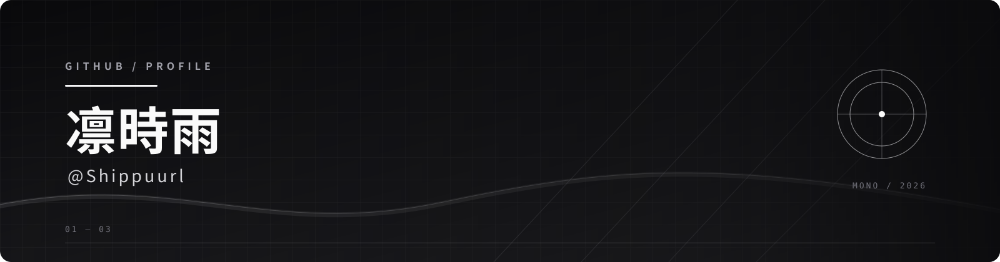

<!--
  Vercel-hosted statistic cards were replaced with Shields badges and ghchart
  so the profile remains visible when Vercel image endpoints are unavailable.
-->

  

  

<h2 align="center">GitHub 统计 / Statistics</h2>

<table align="center">
  <tr>
    <td align="center">
      
    </td>
    <td align="center">
      
    </td>
    <td align="center">
      
    </td>
    <td align="center">
      
    </td>
  </tr>
</table>

<h2 align="center">GitHub 活动 / Activity</h2>

  

